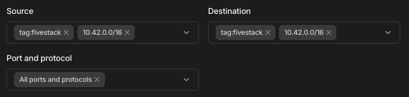
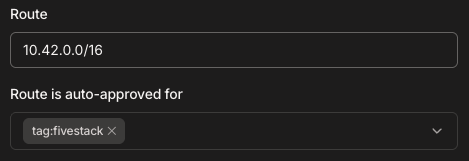
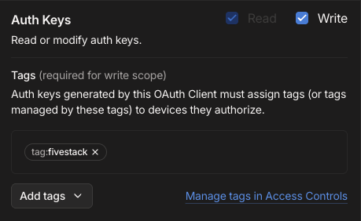

# Failed to Obtain Tailscale Auth Key

If you are unable to obtain a Tailscale auth key when adding a new node to the panel, please check the following:

1. **Enviroment Variables**

   Open `overlays/config/api-config.env` and ensure the following values are present and correct:

   - `TAILSCALE_CLIENT_ID` ([OAuth Settings](https://login.tailscale.com/admin/settings/oauth))
   - `TAILSCALE_NODE_IP` ([Machines](https://login.tailscale.com))
   - `TAILSCALE_NET_NAME` ([DNS Settings](https://login.tailscale.com/admin/dns))

   Open `overlays/local-secrets/tailscale-secrets.env` and confirm:

   - `TAILSCALE_SECRET_ID` is set

   :::info
   You cannot view your secret after it has been created. If you lose your secret, you will need to generate a new OAuth client (see step 4).
   :::

2. **Tag / Access Controls / Auto Approvers**

   Make sure the tag exists and is allowed in [Access Controls](https://login.tailscale.com/admin/acls/visual/general-access-rules):

   

   Also, ensure the tag has an auto approver for the subnet in [Auto Approvers](https://login.tailscale.com/admin/acls/visual/auto-approvers):

   

4. **OAuth Client**

   Go to [OAuth Settings](https://login.tailscale.com/admin/settings/oauth) and ensure your client has the proper permissions:

   
