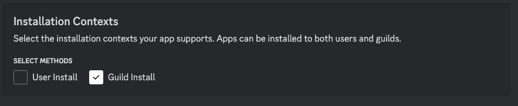

# 5Stack Discord Bot

5Stack includes a Discord bot that can be used to manage your server and provide additional functionality.

## Setup

First, you need to create a new application in the [Discord Developer Portal](https://discord.com/developers/applications).

Then, make sure to enable Guild Install.

## Client ID

You can obtain the client ID from the Discord Developer Portal, where it is labeled as `Application ID`.

In the file `INSTALL_DIR/base/secrets/discord-secrets.env`, you need to update the `DISCORD_BOT_TOKEN`.

## OAuth Setup

Navigate to `https://discord.com/developers/applications/${Application ID}/oauth2` and update the Redirect URL to your `WEB_DOMAIN` URL, which can be found in:

`INSTALL_DIR/base/properties/api.env`.

In the file `INSTALL_DIR/base/secrets/discord-secrets.env`, you need to update both the `DISCORD_CLIENT_ID` and `DISCORD_CLIENT_SECRET`.