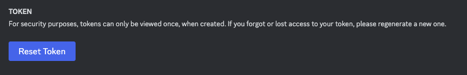

# 5Stack Discord Bot

5Stack includes a Discord bot that can be used to manage your server and provide additional functionality.

## Guide

First, you need to create a new application in the [Discord Developer Portal](https://discord.com/developers/applications).

1. New Application
    

2. Installation Tab

    Only allow Guild Installs and set Intsall link to `none`

    

3. Oauth Tab

    

    * Update the Redirect URL to your `WEB_DOMAIN` URL, which can be found in `INSTALL_DIR/base/properties/api-config.env`.
    * Update the `INSTALL_DIR/base/secrets/discord-secrets.env`, you need to update both the `DISCORD_CLIENT_ID` and `DISCORD_CLIENT_SECRET`.

4. Bot Tab 

    1. You will need to reset the bot token to get a new one.      

      

    In the file `INSTALL_DIR/base/secrets/discord-secrets.env`, you need to update the `DISCORD_BOT_TOKEN`.

    2. Disable Public Bot

      
5. Update the Panel

See [Update Guide](/install/updating) for instructions on updating the panel.

