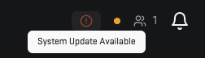

# Updating the 5Stack Panel

Occasionally, you may need to update the 5Stack Panel to the latest version. Currently, this process requires manual intervention:

1. Navigate to the installation directory.
2. Run `git pull` to fetch the latest updates.
3. Execute `./update.sh` to apply any configuration changes.

# Updating 5Stack Components

The 5Stack Panel can update its components (API, Web, Game Server Node Connector, etc.) through the update interface at the top of the application.

